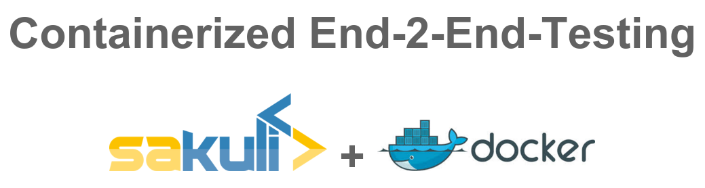

### Zur Präsentation: [Containerized End-2-End-Testing](https://rawgit.com/toschneck/presentation/javaland-containerized-e2e-testing/index.html#/)

### Zum Example: [Sakuli Example Bakery Testing] (https://github.com/toschneck/sakuli-example-bakery-testing)

In der Regel beschreibt der Begriff „End-2-End-Testing“ ein Testszenario, das Systeme in Form eines Black-Box-Tests von außen von einem Ende zum anderen Ende testet. Ziel des Vortrags ist es, dem Zuhörer einen Einblick zu geben wie durch geschickten Tool-Einsatz das Potenzial einer Container-Technologie wie z.B. Docker genutzt werden kann, um die Softwarequalität zu erhöhen und manuellen Testaufwand zu verringern.

Mithilfe des End-2-End-Testing-Framekworks „Sakuli“ ist es im Container möglich sowohl webbasierte Browsertests als auch GUI-Tests auf Rich-Clients durchzuführen. Typische Einsatzszenarien von „containerized End-2-End-Testing“ werden anhand einer Live-Demo betrachtet. Eine abschließende Bewertung der gesammelten Erfahrungen sowie ein Ausblick auf weitere Einsatzszenarien und Entwicklungsschritte runden den Vortrag ab.

Weitere Info's sind unter __[ConSol/sakuli](https://github.com/ConSol/sakuli)__ zu finden.
